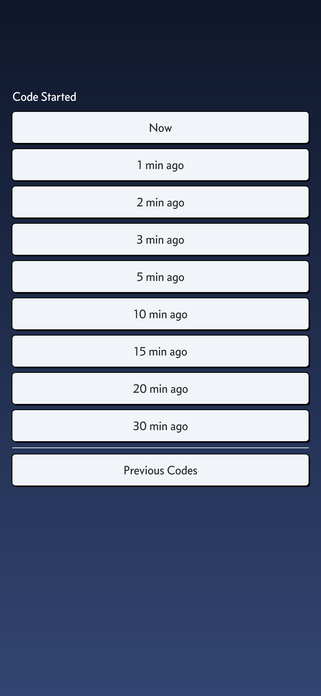
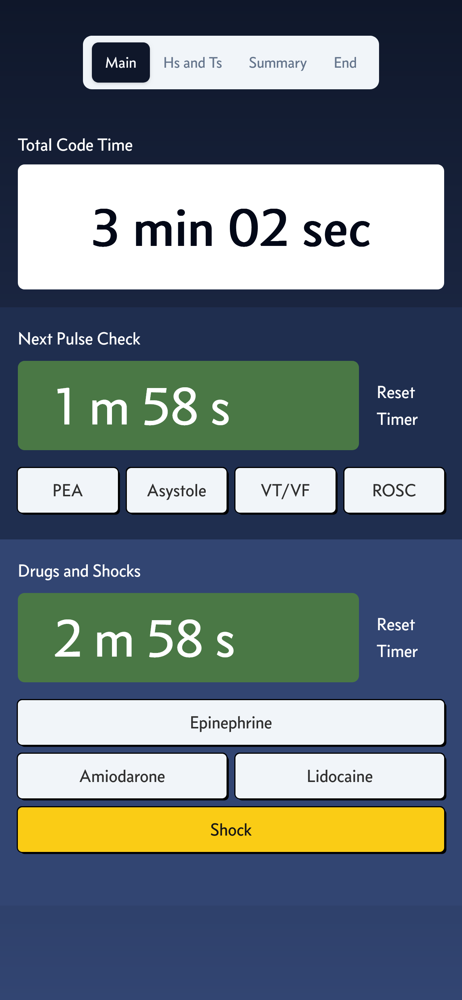
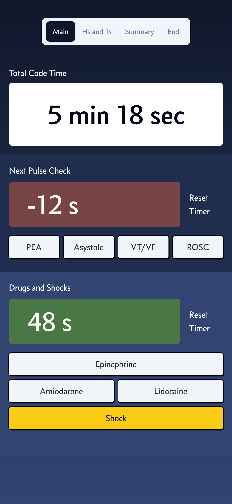
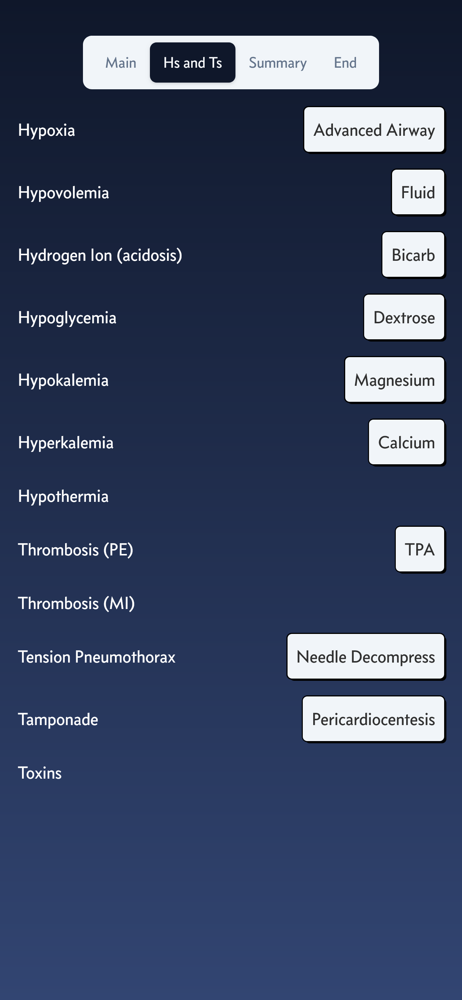
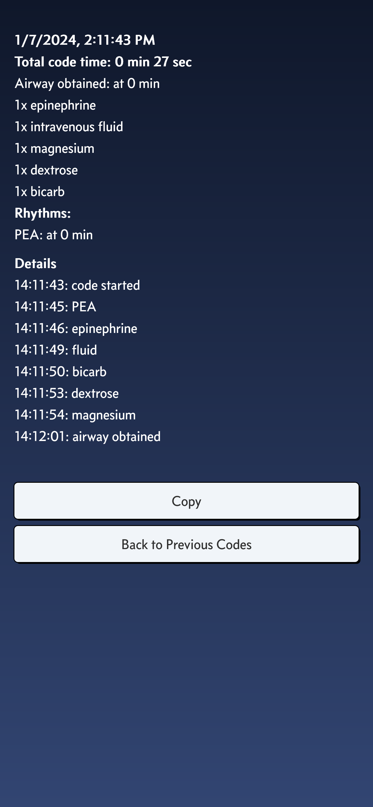

# Awesome Code Recorder

Run better codes with this recorder

- You are more likely to walk into a code minutes later than being there when it starts. This app allows you to add the initial time: 

- Clean overview with timer and countdown

- H's and T's page for reversible causes

- Pause and restart codes

- Copy code summary 

